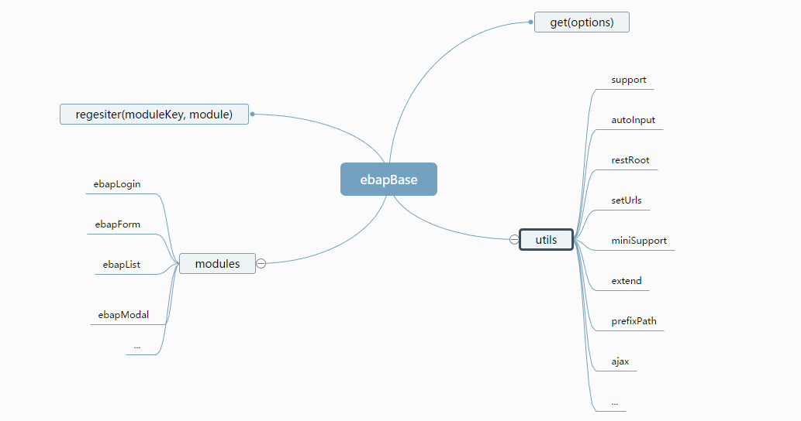

# base.js


## 依赖

1. [jquery](http://www.jquery.com)
2. [miniui](http://www.miniui.com)

## 理念

1. 底层隔离，不直接依赖具体的框架
2. 快速沉淀业务中常用的功能
3. 模块可以自由组合使用
4. 只需简单修改就可以和任何框架使用

## 项目中使用方式

1. 引入需要的miniui和jquery.js以及基础文件base.js
2. 命名base.项目名称.js作为当前项目的扩展模块,并引入到当前页面中
3. 编写当前页面需要的js，书写方式如下:
```javascript
// 全局设置
ebapBase.setUp(function() {
    // 扩展各种函数，模块，重置配置等
});
// 初始化实例
var ebapIns = ebapBase.get({
    id: '',
    key: '',
    settings: {},
    deps: [{
        id: '',
        key: ''
    }]
});
ebapIns.extend({
    search: function () {
        /*
         ebapUtils.getInstance 获取miniui实例
         获取当前主模块实例 this.getIns()
        */
    }
});
// ok 这样一个页面的功能就开发完了
```

