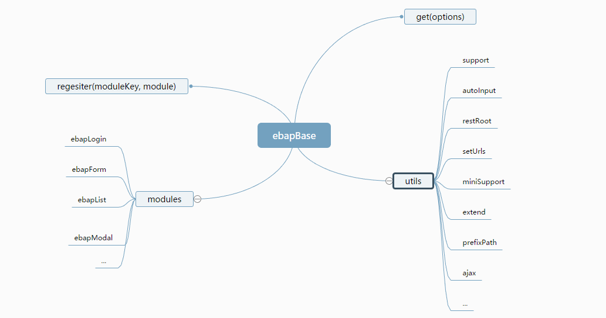

## CONCEPT

1. 底层隔离，不直接依赖具体的框架
2. 整理业务中常见的功能函数，便于快速复用
3. 命名保持高度一致
4. 模块组合

## API
1. ebapBase.get(options)
   > 获取某个模块  options {object}
   
   ```javascript
     // id: 主组件的id,
     // key: 模块的关键字
     // name: 会把get方法返回的实例挂载到window[name]中
     // deps: 生命当前模块的依赖模块,
     // settings: 配置当前页面所需要的url,
     // created: 当模块实例被创建时调用
     
   ebapBase.get({
	id: 'miniuiid', 
	key: 'form|list|login|modal', 
	name: '',
	deps: [{
	  key: 'modal'
	}], 
	settings: {} 
	created: function () {}
    });
    
    ```
2. ebapBase.regesiter
   > 注册模块进入ebapBase.modules里
   
    ```javascript
     // moduleKey 模块的key,module 可以是一个模块函数或者是一个对象，当是对象时，常用于私有模块定义
     ebapBase.regesiter(moduleKey, module); 
     ```
    
3. **ebapBase.utils**
  > ebapBase的公共函数，供内部和外部调用
   
  + ebapBase.utils.support
    判断是否存在某个库，支持某个方法
  + ebapBase.utils.setUrls
    设置urls属性
  + ebapBase.utils.miniSupport
    support的方法简写
  + ebapBase.utils.resetRoot
    重置root路径
  + ebapBase.utils.getDictLabel
    获取字典标签
  + ebapBase.utils.getInstance
    根据id获取某个miniui实例
  + ebapBase.utils.autoInput
    input文本框自动获取输入
  + ebapBase.utils.prefixPath
    为路径自动添加根路径
  + ebapBase.utils.ajax
    对$.ajax进行简单的封装，提供一些默认参数
  + ebapBase.utils.actions
    对一些通用的动作进行封装，比如关闭
  + ebapBase.utils.extend
    为当前实例扩展其他属性，常用于扩展功能

### Modules

1. Form

> 提供Form界面通用功能

```javascript
   var ebapForm = ebapBase.get({
       id:'menuForm',
       key: 'form'
       }
	);
	// 配置保存url，和远程获取数据url
	ebapForm.setUrls({
		save: "/sys/menu/save",
		set:  "/sys/menu/getMenuById"
	});
```

+ settings

   list模块需要的各种数据
   
+ getData

   获取表单的数据

+ setData
  
   设置表单的数据

+ onOk

   点击确定按钮触发

+ onCancel

   点击取消按钮触发

2. List

> 提供列表页面通用功能

```javascript
    var ebapList = ebapBase.get({
        id: 'treegrid1',
        key: 'list',
        showHidden: [{ id: 1, text: '显示' }, 
        { id: 0, text: '隐藏']
    });
```

+ renderers 

   设置模块需要的url，将url存放到模块的settings里

+ settings

   list模块需要的各种数据

+ onDrawCell

   设置单元格的渲染方式

+ add
  
   点击新增按钮，调用这个方法

+ edit

   点击编辑按钮，调用这个方法

+ remove

   点击删除按钮，调用这个方法

3. Login

    > 提供对页面登录和退出的通用控制，目前只开发了退出

+ out
    
      当页面session过期时,将框架最外层窗口重置到登录页


4. Modal

   > 通用弹出窗口
    ```javascript
    var customModal = ebapModal({
        desc: resJson.desc, // 信息描述
        detailInfo: resJson.detailInfo // 信息详情
      }, '.ebap-maskContainer', document
    );
    ```
+ show

  显示弹窗

+ hide

  隐藏弹窗


